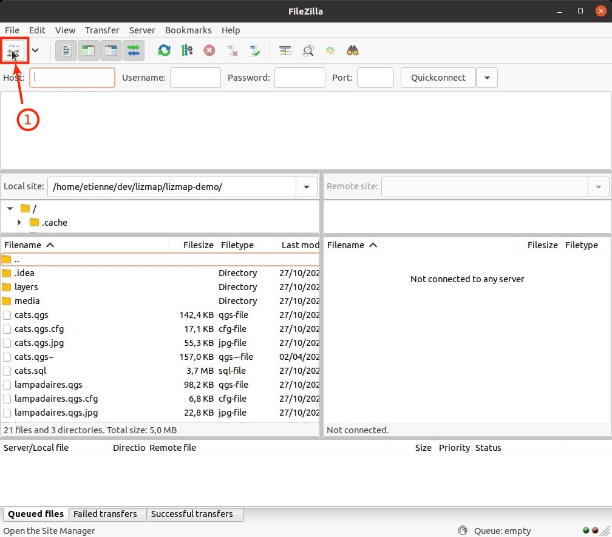
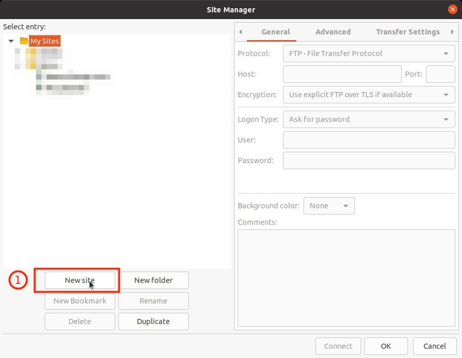
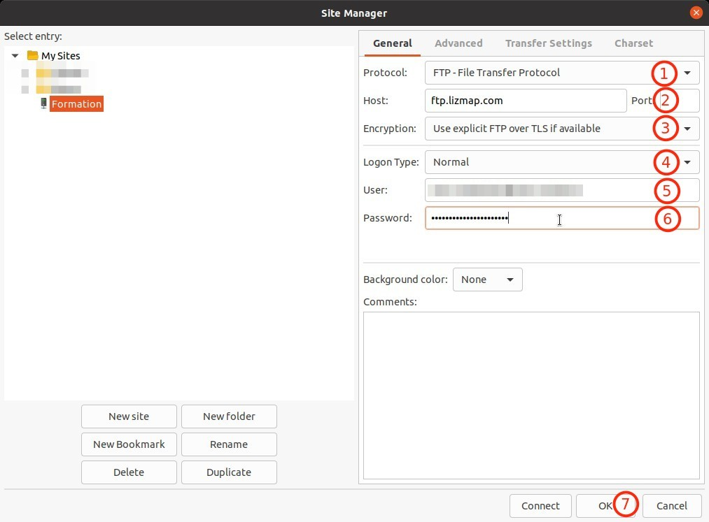
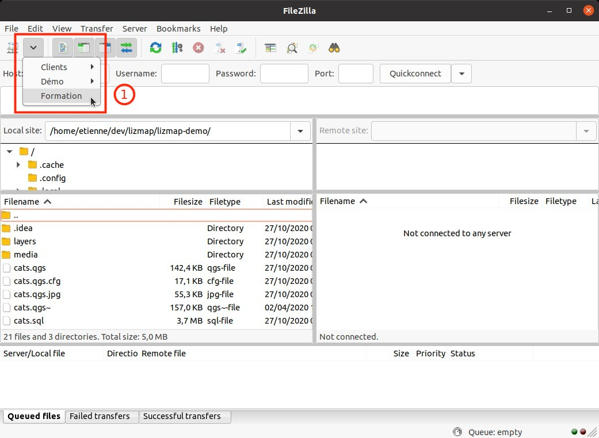
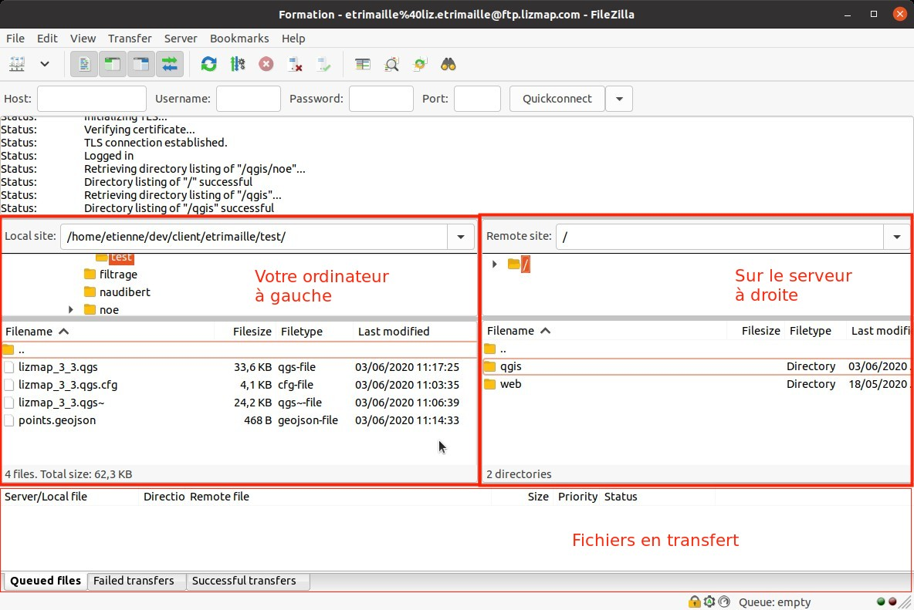

# Filezilla

## Installation

* Vous devez télécharger et installer le logiciel **FileZilla Client** depuis ce lien : 
https://filezilla-project.org/download.php?type=client
  
* Une fois l'installation effectuée, vous pouvez enregistrer la connexion vers le serveur FTP.
  
## Enregistrement de votre serveur Lizmap

* 1 Par email, vous avez du recevoir les identifiants de connexions vers le serveur FTP.
* 2 Ouvrez **FileZilla Client**
* 3 Cliquez sur le premier icône dans la barre d'outils

* 4 **Nouveau site**

* 5 Complétez les informations :
    * **1** : Protocol : `FTP`
    * **2** : Host : `ftp.lizmap.com`
    * **3** : Encryption : `Use explicit FTP over TLS if available`
    * **4** : Logon type : `Normal`
    * **5** : User : Le nom d'utilisateur reçu par email
    * **6** : Password : Le mot de passe reçu par email

**Note**, il est possible de synchroniser la navigation dans l'onglet **Avancé**.

* 6 Validez l'ajout de cette connexion.

* 7 En utilisant le deuxième bouton dans la barre d'outils, vous pouvez vous connecter au serveur FTP

* 8 Vous devriez avoir un écran semblable à celui-ci : 

* Description de l'interface : 
  * En haut, des commandes FTP, pas besoin de s'inquiéter des messages
  * À gauche, votre ordinateur
  * À droite, le serveur
  * En bas, un récapitulatif des données qui sont en transfert.
    
* Par glisser/déposer, nous allons déplacer des fichiers de votre ordinateur vers le serveur.

## Arborescence par défaut

Sur le serveur, **toujours** dans le dossier **qgis**, nous allons créer des répertoires qui seront vos thématiques.
