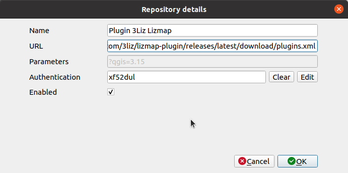

# Add a custom QGIS plugin repository

## Add the repository

In your plugin manager, go in the **Settings** tab.

* Click **Add…**
  

* Fill required information with :
    * **Name** : Name of the repository. You can choose, for instance `Plugin 3Liz XXX`.
    * **URL** : URL which have been provided in the email, for instance 
      `https://github.com/3liz/lizmap-plugin/releases/latest/download/plugins.xml`
    * Press **OK** if your plugin does not require any authentication. If your plugin requires one, 
      [read below](#add-the-authentification).
    * Press **Reload repositories** to fetch the content of the new repository. **This does not install the 
      plugin**, it's only adding a remote server where to find plugins.

* Before going to install the plugin, do not forget to :
    * use the **experimental** checkbox if the plugin is experimental or you won't be able to see it in the next
      step
    * use the **checks for updates on startup** checkbox to let QGIS informs you automatically at a regular 
      interval about any plugin updates

* Go back to the **All** tab to see all available plugin and search for the plugin name in the search bar.
  You should be able to install it.
  
## Add the authentification

The plugin might be protected by a login/password.

In the dialog below, click **Edit** in the **Authentification** section.

By default, you will have **No Authentification**. Click the **+** icon to create one.

* Fill required information with :
    * **Name** : Name of the authentification. You can choose, for instance `3Liz authentification`
    * **Basic authentification**
    * **Username** with the login provided by email
    * **Password** with the password provided
* Press **Save**
* QGIS will fill with a random string the authentification token to access the repository. You can now 
  follow again the previous documentation about **reloading repositories**.
  

