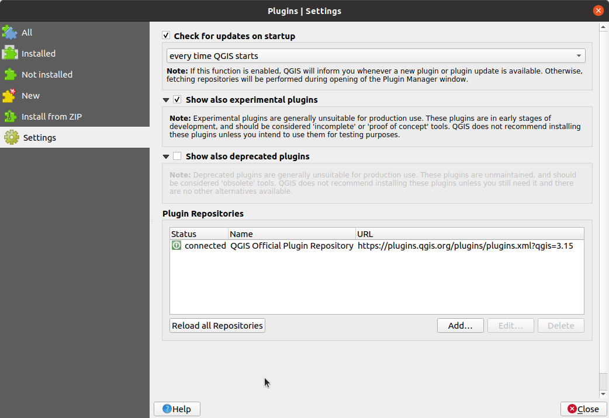
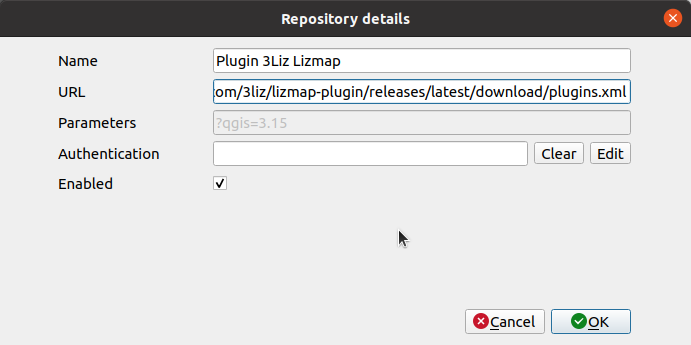
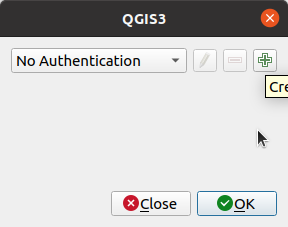
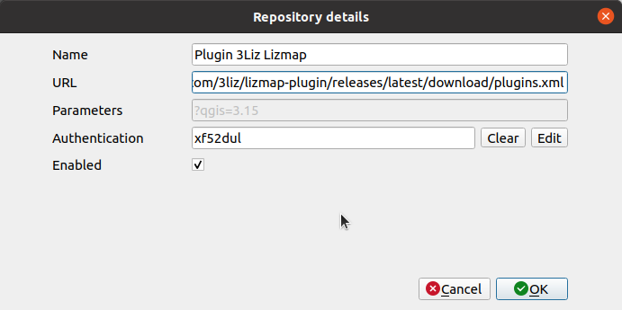

# Ajouter un dépôt personnalisé d'extensions QGIS

## Ajouter le dépôt

Dans votre gestionnaire des extensions, aller dans l'onglet **Paramètres**.

* Cliquer sur **Ajouter…**
  

* Remplir les informations avec :
    * **Nom** : Nom du dépôt. Ce nom est libre à vous, par exemple `Plugin 3Liz XXX`
    * **URL** : URL du dépôt qui a été fournie par mail, par exemple
    `https://github.com/3liz/lizmap-plugin/releases/latest/download/plugins.xml`
    * Cliquer sur **OK** si votre extension ne nécessite pas une authentification. Si votre extension en 
      requière une, [lire plus bas](#ajouter-une-authentification). 
* Cliquer sur **Recharger le dépôt** pour récupérer le contenu de ce nouveau dépôt. **Ceci n'installe pas 
    l'extension**, cela ajoute seulement l'adresse du serveur pour trouver des nouvelles extensions.
    
* Avant d'installer l'extension, ne pas oublier :
  
    * d'utiliser la case à cocher **expérimentales** si l'extension est expérimental. Sinon vous n'allez pas 
      pouvoir voir l'extension à l'étape suivante
    * d'utiliser la case à cocher **Chercher des mises à jour au démarrage** pour laisser QGIS vous informer
      automatiquement des mises à jour régulièrement.
    
* Retourner sur l'onglet **Toutes** pour voir toutes les extensions disponibles et taper le nom de l'extension
  dans la barre de recherche. Vous devriez la voir et être capable de l'installer.

## Ajouter une authentification

L'extension peut être protégée par un nom d'utilisateur/mot de passe.

Dans le dialogue suivant, cliquer **Éditer** dans la ligne **Authentification**.

Par défaut, vous allez obtenir **Pas d'authentification**. Cliquer sur l'icône **+** pour en créer une.

    
* Remplir avec les informations requises :
    * **Nom** : Nom de l'authentification. Ce nom est libre à vous, par exemple `3Liz authentification`
    * **Authentification basique**
    * **Nom d'utilisateur** avec le nom de l'utilisateur dans le mail
    * **Mot de passe** avec le mot de passe fourni
  
* Cliquer **Enregistrer**
        
QGIS va remplir avec une chaîne aléatoire le jeton d'authentification pour accéder au dépôt. Vous pouvez 
désormais re-suivre la section précédente afin de **recharger les dépôts**.

