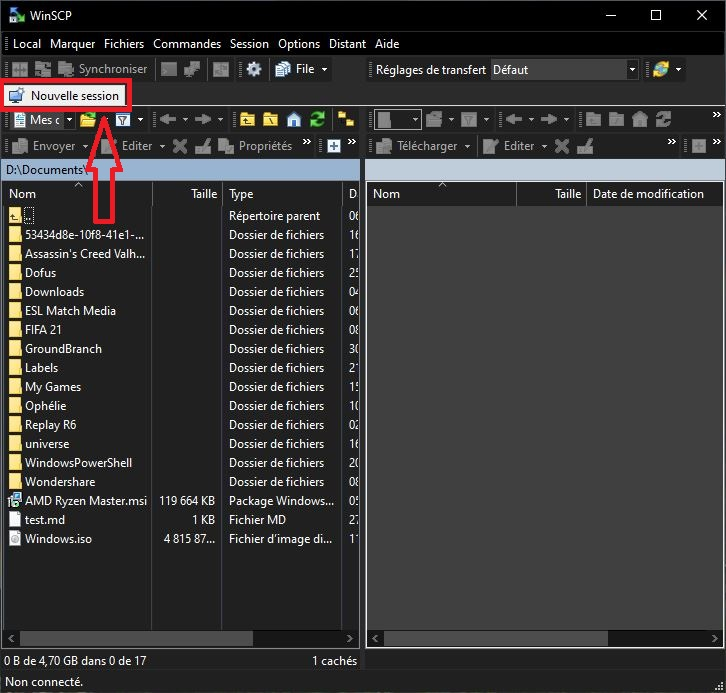
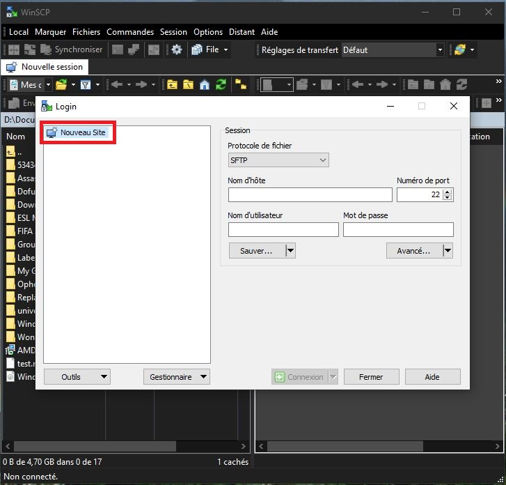
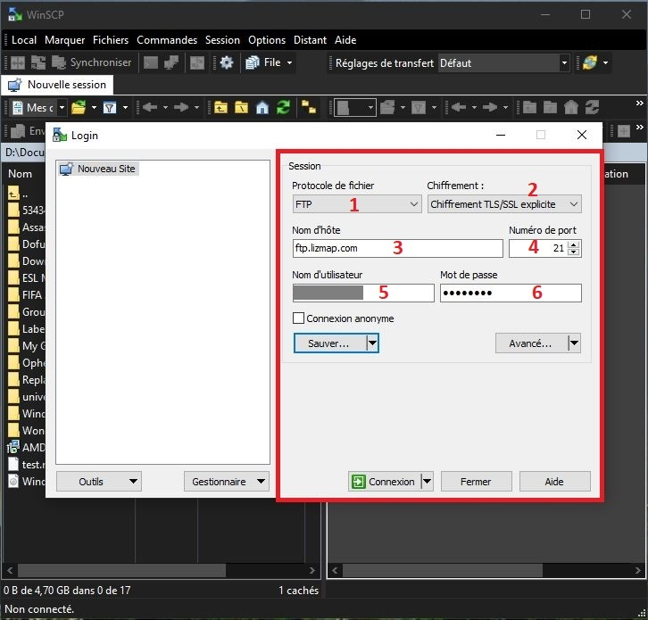
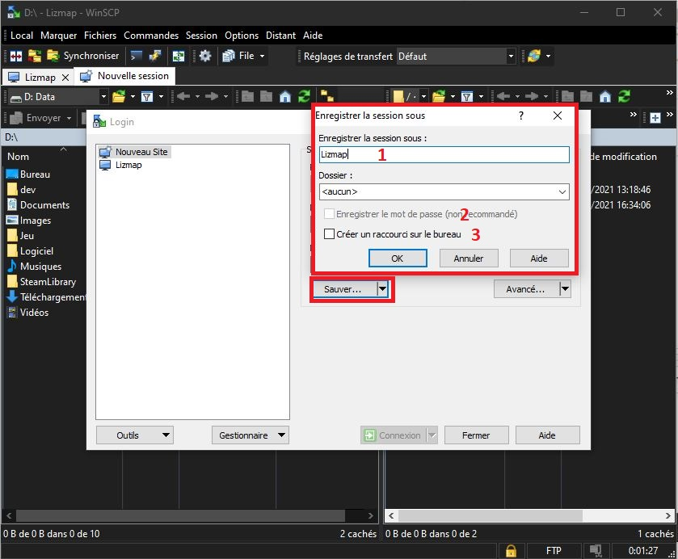
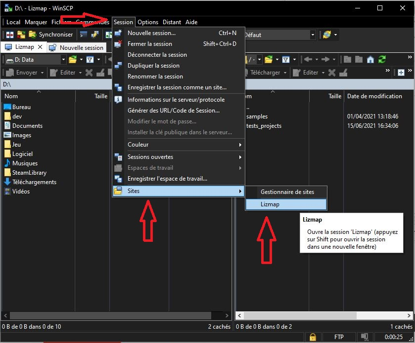
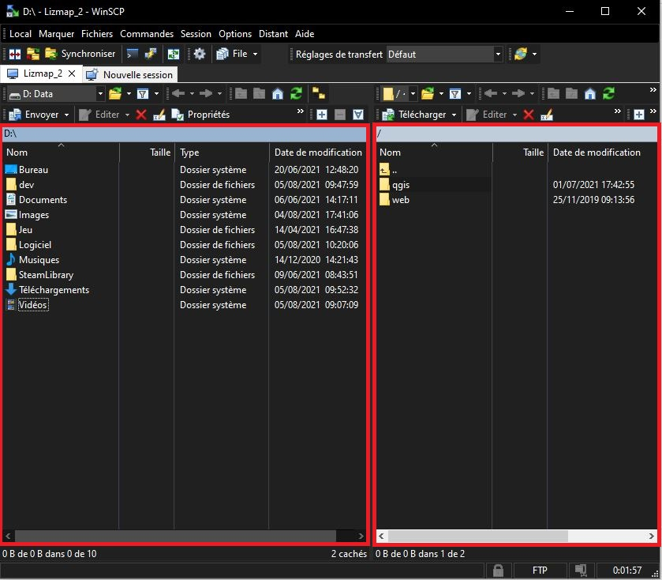

# WinSCP

## Installation

* Vous devez télécharger et installer le logiciel **WinSCP** depuis ce lien: 
https://winscp.net/eng/download.php
  
* Une fois l'installation effectuée, vous pouvez enregistrer la connexion vers le serveur FTP.
  
## Enregistrement de votre serveur Lizmap

* 1 Par email, vous avez du recevoir les identifiants de connexions vers le serveur FTP.
* 2 Ouvrez **WinSCP**.
* 3 Le panneau pour ajouter une nouvelle connexion s'ouvre automatiquement à la première ouverture du logiciel. Sinon cliquez sur le boutton `Nouvelle session` situé en haut à gauche de la fenêtre.

* 4 **Nouveau site**

* 5 Complétez les informations:
    * **1** : Protocole de fichier: `FTP`
    * **2** : Chiffrement: `Chiffrement TSL/SSL explicite`
    * **3** : Nom d'hôte: Le serveur FTP reçu par email
    * **4** : Numéro de Port: `21`
    * **5** : Nom d'utilisateur: Le nom d'utilisateur reçu par email
    * **6** : Mot de passe: Le mot de passe reçu par email

* 6 Cliquer sur sauver pour enregistrer le nouveau site:
    * **1** : Enregistrer la session sous: Nom du site, ex: Lizmap
    * **2** : Enregistrer le mot de passe: Vous pouvez côcher la case si vous le souhaitez
    * **3** : Créer un raccourci sur le bureau: Permet d'avoir un accès direct au site via un raccourci sur votre burreau

* 7 Pour vous connecter à votre nouveau site allez dans l'onglet `Session` puis `Sites` et cliquez sur votre site.

* 8 Vous devriez avoir un écran semblable à celui-ci: 

* Interface description:
  * On the left, your computer
  * On the right, the waiter
    
* By drag & drop, we will move files from your computer to the server.

## Default tree

On the server, **always** in the **qgis** folder, we are going to create directories which will be your themes.
