---
hide:
  - navigation
---

# Lizmap Web Client Worshop - Creating interactive data visualization

## Pre-requirements

This workshop is designed for QGIS users.

* QGIS 3.44
* **Latest** Lizmap plugin on QGIS Desktop
* Lizmap Web Client **3.9.X**

## QGIS UC 2026

Presentations from 3Liz talking about **QGIS Server** during this QGIS UC :

* **Today, Monday October 5**
    * "QJazz - QGIS Server ready for the cloud": 4:30 PM, room Pegna
* **Tuesday October 6**
    * "Lizmap Web Client: next steps": 9:30 AMn room Hangar
    * "Managing a topological county road 🚗 network: linear referencing with QGIS & PostGIS": 2:00 PM, room Bridge 2

## Links

* Demo https://demo.lizmap.com
* Lizmap cloud out-of-the-box https://www.lizmap.com
* PDF/HTML presentations and videos https://docs.3liz.org/talks/#lizmap
* Discourse channel https://discourse.osgeo.org
* Social accounts :
    * Mastodon [https://mapstodon.space/@LizmapForQgis](https://mapstodon.space/@LizmapForQgis) dedicated to Lizmap
    * Bluesky [https://bsky.app/profile/lizmap.com](https://bsky.app/profile/lizmap.com)
* Source code
    * Lizmap Web Client https://github.com/3liz/lizmap-web-client/
    * Lizmap QGIS Desktop side https://github.com/3liz/lizmap-plugin/
    * Lizmap QGIS Server side https://github.com/3liz/qgis-lizmap-server-plugin
    * 3Liz https://github.com/3liz/ for QGIS Server plugins, Lizmap modules
* National user group
    * [German mailing list 🇩🇪](https://lists.osgeo.org/mailman/listinfo/lizmap-de)
    * [Japan Facebook group 🇯🇵](https://www.facebook.com/groups/lizmapusergroupjapan)
    * ... ?
* [Stafe of translations](https://docs.3liz.org/lizmap/#translations)

## Documentation

* https://docs.lizmap.com/
  * Check [the architecture and manuals](https://docs.lizmap.com/current/en/introduction.html)

## Discover the data

**Land use polygon layer** from "Le Grand Narbonne" open-data website: format **FlatGeoBUF** `.fgb)`

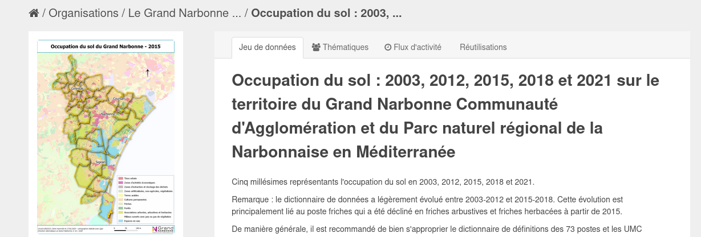

Direct access:

* [Land use in 2021](media/short_dataviz/data/ocsol_gn_pnr_2021.fgb)
* [Evolution between 2018 & 2021](media/short_dataviz/data/evol_2018_2021.fgb)
* [Metadata sheet with classification and colors](media/short_dataviz/data/Nomenclature_2015_2018_2021.xlsx)
* [Cities](media/short_dataviz/data/limites_communales.fgb)

**Raw data** displayed in QGIS:

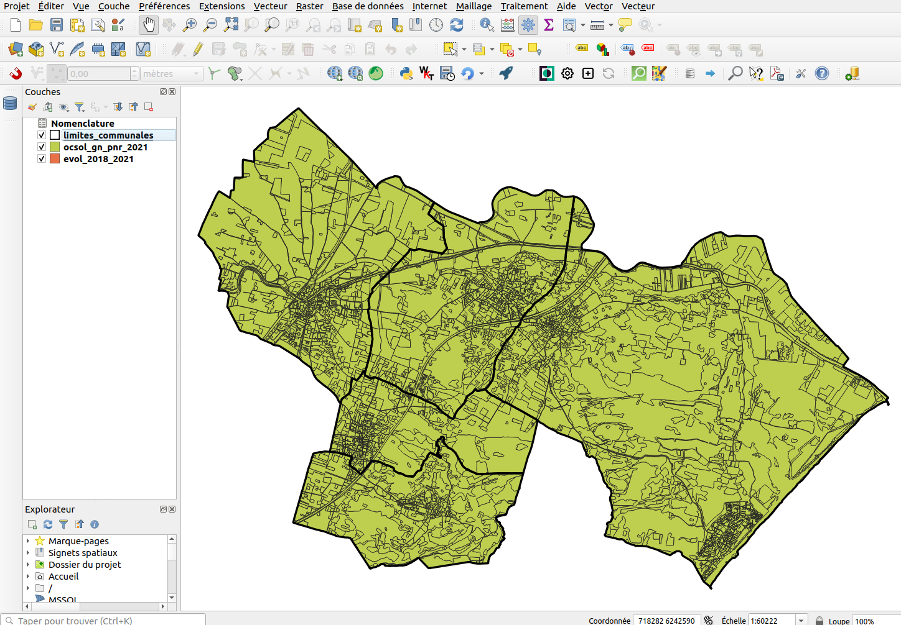


## Setting up the training

* Install the **Lizmap** extension on your QGIS Desktop. Menu Extension
* **Open it**, either from the toolbar, or from the **Web** menu
* Click **Add your first server** or the **+** icon at the bottom
* Fill the wizard :
     * **URL** : https://workshop.lizmap.com/qgisuclaax/
     * **Login** : `qgisuc_X`, replace `X` by your number (ex: `1` or `14`) in login and password. For example `qgisuc_4`
     * **Password** : same as the username

!!! warning
    QGIS **might** ask you to set up a **master password**. This password belongs to **you** and is not linked to Lizmap.
    It's to lock **your internal QGIS password manager**.

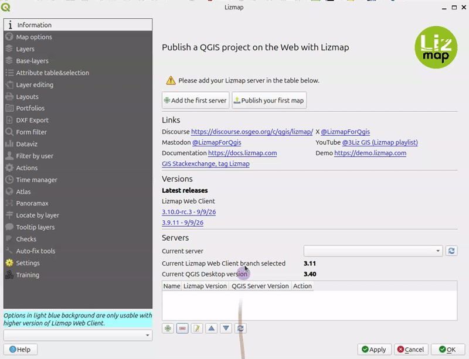

!!! question
    Is-it 👍 or something else ?

!!! info
    This short workshop was designed for **90 minutes**, so some steps in the QGIS downloaded project are already done.

Now you should be able to go to the **Lizmap plugin** `Training` tab (the last one at the bottom of the left menu), fill the form, and click the `Download and extract` button, then `Open file browser`

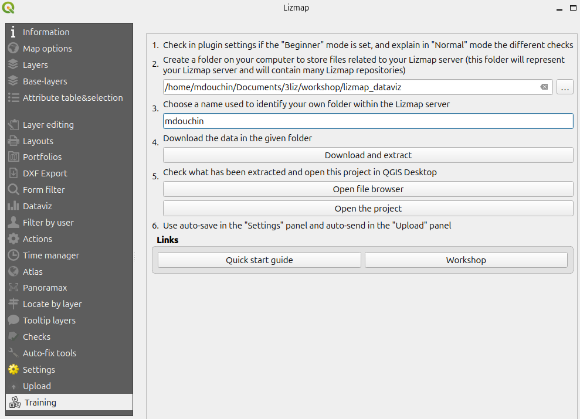

!!! info
    Please open the newly created QGIS project in QGIS.


## The workshop QGIS project

The QGIS project **demo_XXXX.qgs** built for this shot workshop:

* **shows the data** organized in a **layer tree**
* the **layers have been styled** based on the given metadata (colors corresponding to the land use categories)
* Each land use data layer has
  * a `code_insee` field, which is the unique code of one of the 5 cities.
  * a `color` field containing the color of the corresponding category. It is based on a **QGIS expression** using the field from a join with the `glossary` layer.
* the **group Land use** have been configured to let only one layer visible at a time (mutually exclusive)
* **relations** have been set up in the QGIS project properties dialog (links between cities and the other layers)
* A **aerial photo** layer has been added

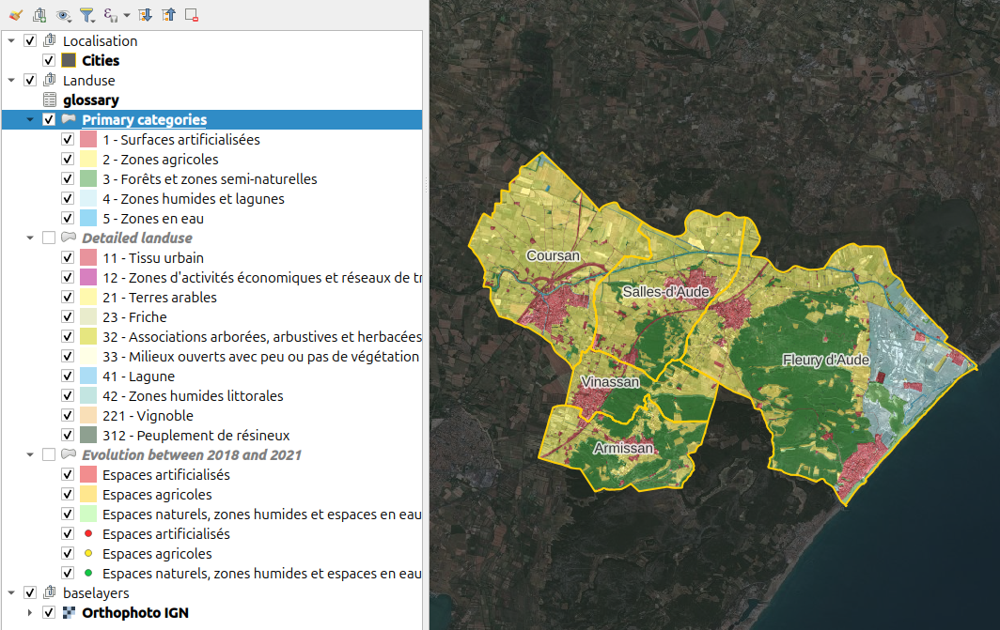


## First Lizmap publication

!!! info
    *Please open the QGIS project if it is not done yet*

You can open the **Lizmap plugin** : menu `Web / Lizmap` or click the icon in the web toolbar.

* In the **Layers tab**, make some layers visible by default
* Click on the `Apply` button.
* Skip the dialog *First Lizmap configuration*.
* Applying will save a **Lizmap configuration file** in the same folder as your QGIS project. For example `demo_qgisuc_1.qgs.cfg` if your project name is `demo_qgisuc_1.qgs`.
* At the **bottom left**, let's choose the remote directory where to send this project
  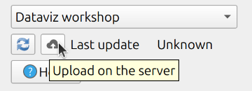
* Send the project to the server with the button `Upload on the server`
* Visit your Lizmap project map in the web browser: https://workshop.lizmap.com/qgisuclaax/index.php

## Plot configuration

With the **dataviz** panel of the **Lizmap plugin**, you can create a few kinds of graph with only a few clicks: **scatter, pie, histogram, box, bar, histogram2d, polar, sunburst, HTML**

You can **add as many plots as needed**.

Each plot is based on the **data** of a **QGIS vector layer**.

To **add a new plot** in your Lizmap project map:

* Click on the **+** button
* Select the **type of chart** to add. Use `bar` or `pie`. (`histogram` must rarely be used !)
* **Title** : Here you can write the title you want for your chart.
* **Description** : The description of the chart. You can include HTML.
* **Select the vector layer** in the drop-down list.
* **X field** : The X field of your graph. It is the **base configuration** used for creating **groups of data** (dates, city codes, categories, etc).
  (It might be empty for a few types, e.g. box plots)
* **Aggregation** : Lizmap will **aggregate** the data, **grouped by unique values of the X field**. There are a few aggregate functions available - `average(avg)`, `sum`, `count`, `median`, `stddev`, `min`, `max`, `first`, `last`.
* **Traces** : You can add one or many traces : the **Y field(s)** of your graph.
  They represent **the value to be ploted**. If more than one value in the chosen Y fields share the same X value, they will be aggregated.

<details>
  <summary>Additional plot options (click to show)</summary>

  * **Layout** : The layout can be customized. It must be a JSON dictionary.
    You can read the [documentation of Plotly](https://plotly.com/javascript/reference/layout/) about the **layout configuration**
  * **Display filtered plot in popups of parent layer** : if you check this checkbox, the children of your
    layer will get the same graph as the parent plot but filtered only for them.
    It's useful if you want to see the statistics of one entity instead of all.
  * **Only show child popup** : The main graph will not be shown in the main container and only the filtered
    graph of the relation of the layer will be displayed in the popup when you select the element.
  * **Display the legend**, sometimes, the legend is not necessary.
  * **Display plot only when the layer is visible**.
</details>


!!! info
    Some options might be visible or not according to the kind of chart, like choosing for horizontal/vertical layout for a bar chart.

## Create our first plot: a pie chart with the main landuse categories

We want to add a **Pie chart** from the layer "Main categories". In the **Dataviz tab** of the Lizmap plugin, add a new chart, and configure it:

* Choose the `Pie chart` type
* Write a simple **title**
* Choose the **layer** `Primary categories`
* `X Field`: Use the `Niveau 1` (level 1) field which contains the label of the main category of land use for each polygon
* Use `Sum` for **aggregation**
* Add one **trace** with
  * the **Y field** `Surface (ha)` which contains the polygon area in ha (real number)
  * the **color field** `color` which contains the color corresponding to the level 1 land use
* **Validate** with `OK`

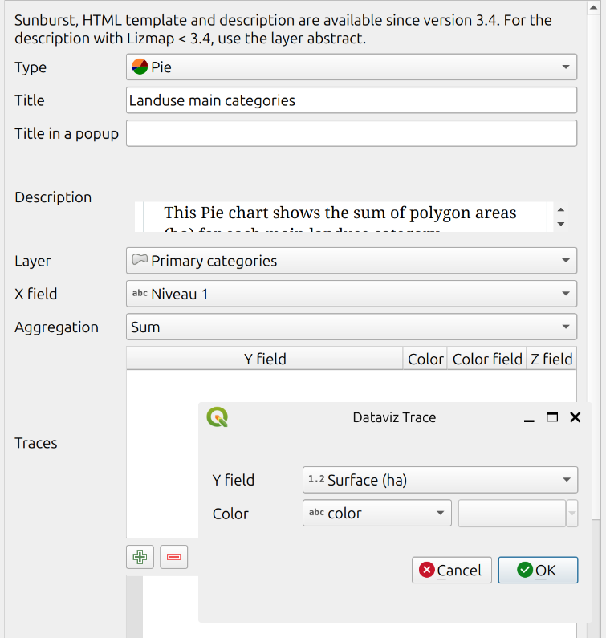

The Lizmap plugin table inside the `Dataviz` tab now shows the configured plot

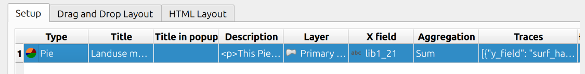

**Apply**, and **send your project** & lizmap configuration


Go to your map, and see the result

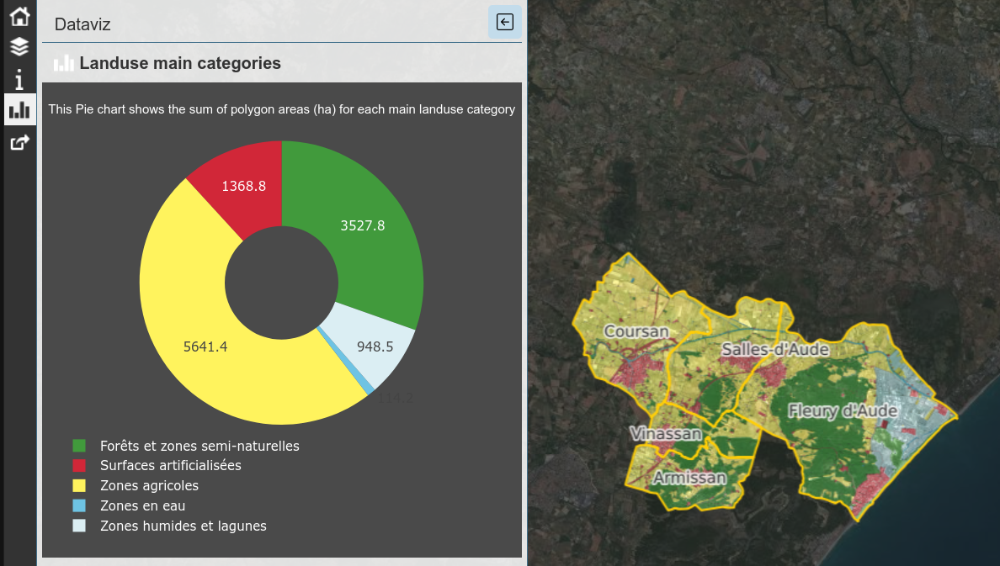


## A bar chart with more detailed land use categories

We would like to show a **bar chart** of the **Level 2** categories, displayed by **descending total of surface**.

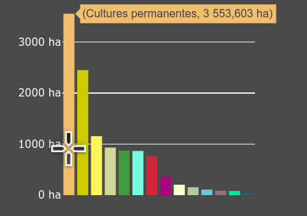


<details>
  <summary><b>Try it yourself !</b> Configure the bar chart, layer "Detailed landuse"</summary>

  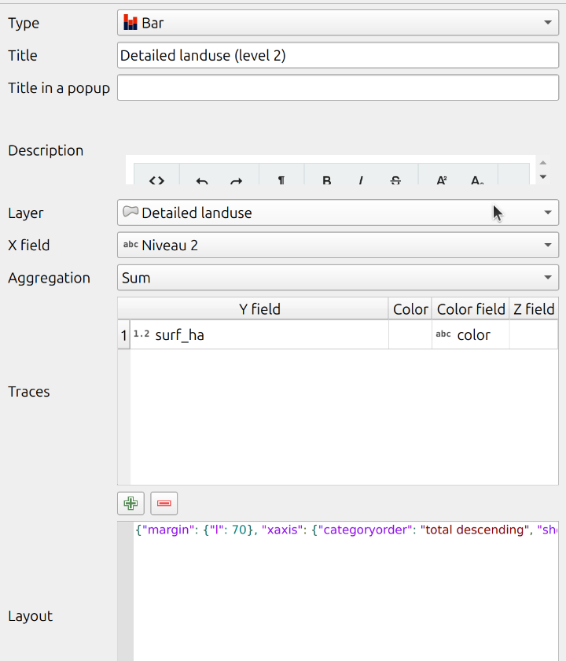

  Here is the JSON to add in the **layout**
  ```json
  {"margin": {"l": 70}, "xaxis": {"categoryorder": "total descending", "showticklabels": false}, "yaxis": {"tickformat": ",.2f", "ticksuffix": " ha"}}
  ```

  Also **uncheck** the checkbox `Display the legend`
  and **check** the checkbox `Display plot only when the layer is visible`
</details>

Once configured, you can also apply & send, to see the result in Lizmap Web Client

## A special & versatile plot type: the HTML plot

This type of plot allows to **create and style your own content** based on the source vector data.

We will try a **very simple example first**, and then try to add **a more complexe plot**.

### Simple HTML plot

**Principle** : you can use the `HTML` language, as in some parts of **QGIS** (print layouts, labels, etc.) to create your content.

Lizmap will automatically replace variables `{$x}` with the values from the **X** field and `{$y1}`, `{$y2}` from the  **aggregated values** of the traces (Y) data.

Lets configure it with **Lizmap plugin**

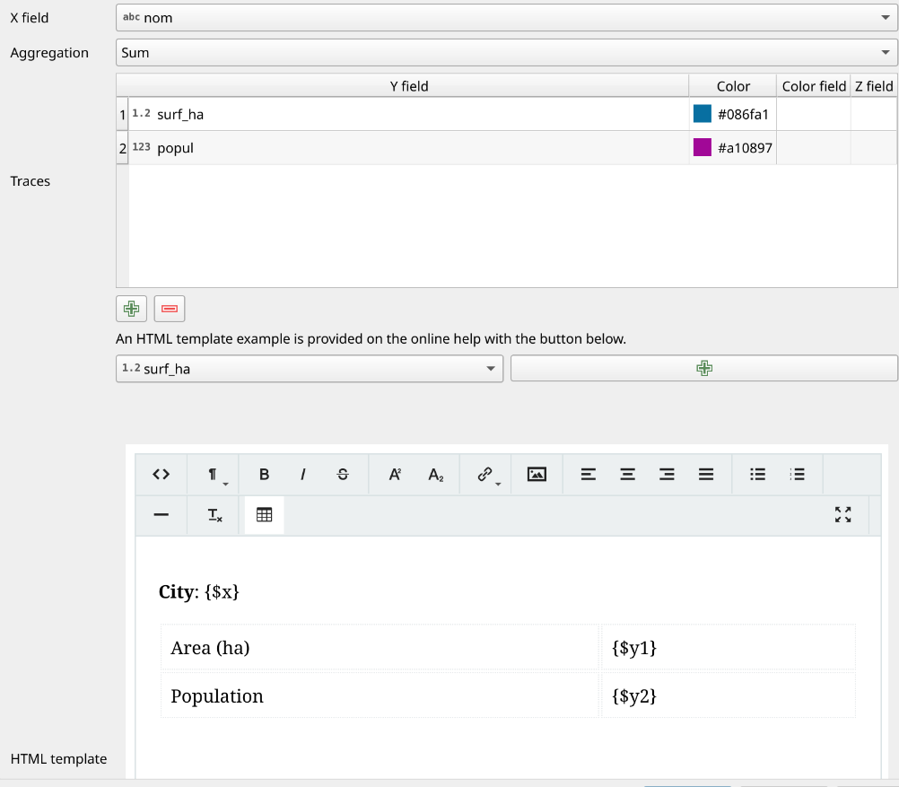

Result:

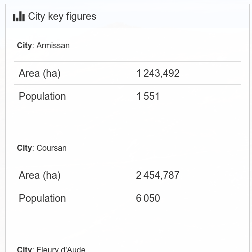

You see Lizmap will display **one HTML block per X unique value**. If you want to sum up all data (and lose the City name), you could use `depart` for the **X field** (which is unique accross all cities) and remove the line `City: {$x}` from the HTML template.

## Filter the data for a given city

TODO
