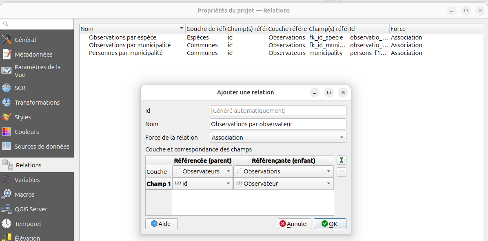
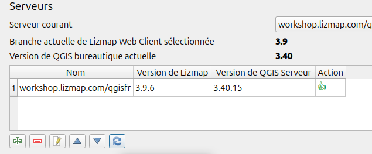
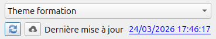

# Première publication rapide

Nous allons d'abord **installer l'extension Lizmap pour QGIS**,
récupérer le **projet de formation**, puis **publier notre première carte** visualisable sur
internet.

## Extension Lizmap

* Installer l'extension Lizmap
* Cliquer sur **Ajouter votre premier serveur** et suivre les étapes
    * L'URL de la page d'accueil, exemple : `https://workshop.lizmap.com/qgisfr/`
    * Le nom d'utilisateur et son mot de passe
    * Si ces informations sont correctes, il demande le nom du serveur. Ce nom est libre, pour votre organisation.
* Si votre serveur s'affiche bien dans le tableau, c'est bon 👍
* Dans les **paramètres** :
    * **Enregistrer le projet QGIS automatiquement**
    * Passer en mode **Débutant** 😏
* Fermer l'extension Lizmap **avec la croix** (pas avec le bouton OK)
* Réouvrir l'extension, et aller sur l'onglet `Formation`
    * Suivre les étapes 1 à 5 qui vont vous permettre de **télécharger le projet de formation**
      dans un répertoire que vous aurez créé spécifiquement sur votre ordinateur

## Manipulation dans QGIS

* Ouvrir le projet qui vient d'être téléchargé
* Mettre un zoom et une emprise correcte (en montrant toutes les îles)
* Dans les propriétés du projet :
    * Menu **Projet** / **Propriétés**
    * Onglet **Relations**, ajouter toutes les relations
        * Couches PostgreSQL : **automatiquement** avec le bouton **découvrir**
        * Sinon ajouter 3 relations entre les couches respectives
            * `municipalities` & `observations`,
            * `municipalities` & `persons`,
            * `species` et `observations`
          
    * Onglet **QGIS Serveur**,
        * **Capacités des services**
            * mettre un **titre** et un **résumé**
        * **Capacité WMS**
            * utiliser l'emprise actuelle du canevas dans l'**étendue annoncée**.
        * **Capacité WFS**
            * **publier** toutes les couches
    * Cliquer sur **OK**."
* Ouvrir l'extension Lizmap
* Appliquer la configuration Lizmap en cliquant sur le bouton `Appliquer`
  (le fichier Lizmap `.qgs.cfg` est créé dès que l'on applique on qu'on ferme la fenêtre avec `OK`)
* Quitter l'extension Lizmap en cliquant sur OK

!!! tip
    **Bonus** si vous avez une petite image PNG qui se nomme `nom_du_projet.qgs.png` pour remplacer l'image du projet par défaut.
    Vous pouvez regarder l'aide dans l'extension Lizmap → **Options de la carte** pour avoir de l'aide sur la vignette.
    Il faut mettre cette image à côté de votre fichier `nom_du_projet.qgs`. L'image peut-être **jpeg** aussi.

## Configurer Lizmap Web Client pour recevoir les projets QGIS

!!! warning
    **Seul un** participant va faire la manipulation suivante afin de publier le dossier avec **l'ensemble** des projets QGIS.

* Se rendre dans l'interface d'administration
    * Menu `Lizmap` / `Gestion des cartes`
    * Bouton `Ajouter un répertoire`
    * Choisir le répertoire local `theme_formation`, puis remplir les autres champs
    * Valider

## Envoyer votre projet QGIS et la configuration Lizmap sur le serveur

* Dans votre QGIS, ouvrir l'**extension Lizmap**
* Dans le panneau `Information`, cliquer sur le bouton "double-flèche bleue" `Rafraîchir les serveurs`
  
* Le nom du répertoire `Theme formation` apparaît dans la liste déroulante située tout en bas
  à gauche du plugin
* Dans l'onglet **Envoi**, il faut
    * cocher la case `Envoi automatique lors de l'enregistrement`
    * Cliquer sur les boutons `1. Actualiser les fichiers locaux utilisés` puis `2. Envoyer ces fichiers sur le serveur`
* En bas à gauche, à gauche de la liste déroulante qui affiche `Theme formation`,
  cliquer sur le bouton `Envoi sur le serveur` (nuage avec flèche vers le haut)
  
* Se rendre sur la page d'accueil de l'application Lizmap Web Client puis sur votre carte

!!! success
    Dans votre légende Lizmap, si vous pouvez voir vos couches et les afficher, c'est que ça marche !

**Nous allons désormais [personnaliser l'affichage de nos couches](./lizmap-short-03-legend.md), par exemple afficher
certaines couches par défaut 👉**
