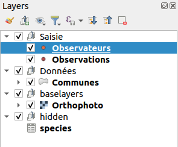
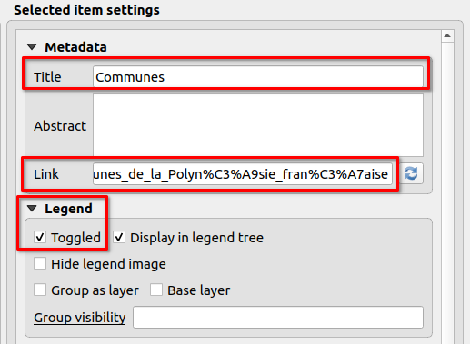

# Légende

* Faire des groupes dans la légende
    * `Saisie`
    * `Données`
    * `hidden`, avec `h` minuscule
* Ranger les couches dans les groupes en regardant la capture ci-dessous  
* Renommer les couches avec un nom plus présentable
    * **Exception** pour l'orthophoto IGN, dans le groupe `hidden` qui doit avoir le nom `ign-photo`
    

!!! success
    Lizmap utilise **QGIS Serveur** en arrière-plan, la légende est donc identique que sur QGIS Bureautique.

    Certaines configurations dans le projet QGIS **ou** dans l'extension Lizmap ont un impact dans l'interface web.

!!! tip
    **À partir de maintenant**, envoyez souvent les données sur le serveur pour voir les modifications.

* Faire une symbologie rapide sur les points.
* Ajouter des étiquettes avec le nom de la commune et ajouter un seuil de visibilité en fonction de l'échelle (1:300 000)
    * Champs `name` pour la source des étiquettes
    * Onglet **Rendu**, seuil de visibilité minimum 1:300 000
* Manipulation dans **l'extension** Lizmap, dans l'onglet **Couches** :
    * Pour les **communes**, mettre la couche visible par défaut
    * Ajouter des **liens** sur deux couches :
        * PDF pour les observateurs : `media/metadata.pdf`, un lien vers un PDF, stocké dans le dossier `media` (vous pouvez le voir dans le logiciel FTP)
        * HTML pour les communes : `https://fr.wikipedia.org/wiki/Liste_des_communes_de_la_Polyn%C3%A9sie_fran%C3%A7aise`
    * Dans l'onglet **fond**, ajouter la couche **IGN France** **Orthophoto**. Désormais, on n'a plus besoin de clé.

**Rendons notre carte "interactif" pour répondre au clic sur la carte avec l'usage des [popups](./lizmap-short-04-popups.md) 👉**
