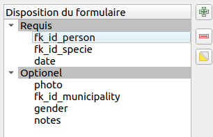
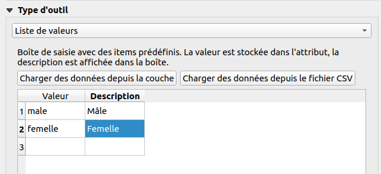

# Édition d'une couche

On souhaite désormais rendre éditable une couche depuis l'interface web afin de pouvoir ajouter des **observations**.

* Dans QGIS, faire un essai du formulaire par défaut sur la couche des **observations**. Vous avez besoin de passer en mode édition d'abord avec le petit crayon **jaune**.
* Améliorer le formulaire dans QGIS :
    * Propriétés de la couche ➡ Formulaire d'attributs ➡ Conception par glisser/déposer
    * Supprimer le champ `id`
    * Faire 2 groupes : `Requis` et `Optionel`

* Configurer les champs :
    * `fk_id_person` :
        * Alias `Observateur`
        * Référence de la relation avec `name`
    * `fk_id_specie` :
        * Alias `Espèce`
        * Valeur relationnelle `species` Colonne clé `id` et  Valeur `es_nom_commun`
    * `date` :
        * Alias `Date`
        * Date/heure par défaut
    * `photo` :
        * Alias `Photo`
        * Pièce jointe
    * `gender` :
        * Alias `Genre`
        * Liste de valeurs : `Mâle`, `Femelle`
    * `fk_id_municipality` :
        * Alias `Commune`
        * Valeur relationnelle `Communes` Colonne clé `id` et Valeur `name`
          * Filtre par expression possible `intersects($geometry, @current_geometry)`

* Une fois que le formulaire est OK dans QGIS (à peu près 🙂), ajouter l'**édition** dans l'extension Lizmap pour cette couche.

!!! success
    On peut utiliser des expressions QGIS dans les formulaires (visibilité, conditions, valeurs par défaut etc).
    [Lire la documentation](https://docs.lizmap.com/current/fr/publish/configuration/expression.html).

!!! tip
    En l'absence de couches PostgreSQL pour cette formation, on peut voir le projet
    [fait](https://workshop.lizmap.com/qgisfr/index.php/view/map?repository=themeformation&project=formateur).

**Désormais, on souhaite pouvoir [proposer des exports PDF](./lizmap-short-07-print.md), avec ou sans **atlas** dans notre projet 👉**
