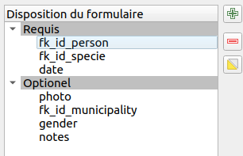
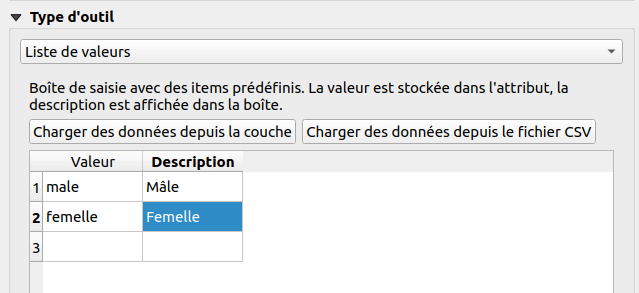

# Workshop Lizmap

## Pre-requirements

This workshop is designed for Lizmap users, half day.

* FTP Client (WinSCP for Windows, Filezilla for MacOS/Linux)
* QGIS 3.16
* Lizmap plugin on QGIS Desktop
* QGIS project attached in the email
  * The QGIS project contains layers from the PostgreSQL database

## Documentation

* https://docs.lizmap.com/

## Links

* Demo https://demo.lizmap.com
* Lizmap hosting out-of-the-box https://www.lizmap.com
* Mailing-list Osgeo Lizmap
    * https://lists.osgeo.org/mailman/listinfo/lizmap
* Twitter account : 
  * https://twitter.com/LizmapForQgis dedicated to Lizmap
  * https://twitter.com/3lizRelease everytime we make a new version on GitHub in one of our project
* Source code
  * Lizmap Web Client https://github.com/3liz/lizmap-web-client/
  * Lizmap QGIS side (desktop and server) : https://github.com/3liz/lizmap-plugin/
  * 3Liz https://github.com/3liz/ for QGIS Server plugins, Lizmap modules

## First quick map

* Open the project
* Set the extent on the map canvas
* In the Project Properties :
      * **Relations** tab, add all relations **automatically* with **Discover Relations**
      * **QGIS Server** tab,
          * **Service capabilities**, set a **title** and an **abstract**
          * **WMS capabilities**, use the current canvas extent
          * **WFS capabilities**, publish all layers
* Open the Lizmap plugin
* **Only one time**, add a server with your instance home page URL
* Close the Lizmap plugin (it's creating the Lizmap file when closing the window).
* Transfert the project (`.qgs` et `.cfg`) in the folder `qgis/topic_workshop`

**Bonus** if you have a small PNG picture called `name_of_project.qgs.png`.

## Quick overview of the Lizmap web interface

* The map
* Lizmap folders
* Administration panel

## Legend

* Faire des groupes dans la légende
    * `Edition`
    * `Data`
    * `hidden`, with small `h`
* Rename layers with a more human-readable
    * **Except** for the OSM layer, in the group `hidden`, the name must be `osm-mapnik`


**Starting from now**, often send the QGS file and the CFG file on the server to check the result between each bullet.

* Make a quick symbology on the Municipalities layer :
    * **Categorized** on `name`
    * Tip, change the symbol to remove the fill
    * Remove the line `Water`
* Go in the Lizmap plugin, **Layers** tab
* Set a link on a layer : 
    * `media/metadata.pdf`, a PDF link, stored in the folder `media` (you can see it in the FTP client) on `observations`
    * `https://en.wikipedia.org/wiki/French_Polynesia` on `municipalities`
* In the Lizmap plugin, go in **Baselayers** and add the OpenStreetMap Mapnik background.

## Attribute table

* From the plugin, enable the attribute table for the **municipalities** layer.

## Let's add some popups

* In the Lizmap plugin, enable some popups on the layer **municipalities** with `auto` mode.
* Add some **aliases** on fields to "clean" them from the **layer properties** ➡ **Attributes Form** ➡ a specific field ➡ **Alias**.
* Let's switch to a popup with **QGIS** mode :

**Tip** : QGIS ➡ **View** ➡ **Display maptip** to display maptip straight in QGIS Desktop.

These **QGIS** popups are powerful with the use of QGIS **expressions**:

```html
<ul>
<li>[% "name" %]</li>
<li>[% "population" %]</li>
</ul>
```

You can use expressions :
    * to display with capital letters
    * to display in red if the population is less than 20 000 inhabitants

## Editing capabilities on a layer

We want now to enable editing capabilities on a layer in the Lizmap interface, to let some users add some **observations**.

* In QGIS, try to add a point and check how the **default** form is displayed on the layer **observations**. You need to toggle editing mode first with the **yellow** pen.
* Improve the form in QGIS :
    * Layer Properties ➡ Attributes Form -> Drag&Drop layout form
    * Remove the field `id`
    * Make two groups : `Required` and `Optional`
    


* Field configuration :
    * `fk_id_person` :
        * Alias `Watcher`
        * Relation reference with `name`
    * `fk_id_specie` :
        * Alias `Species`
        * Value relation `species` `id` et `es_nom_commun`
    * `date` :
        * Alias `Date`
        * Date/Time; by default
    * `photo` : 
        * Alias `Photo`
        * Attachment
    * `gender` : 
        * Alias `Gender`
        * Value map : `Male`, `Female`



* As soon as you have your form ready in QGIS (more or less 🙂), add the layer in the editing
  panel in Lizmap

## Dataviz

* Add bar chart in the Lizmap plugin about population in municipalities
* Still on the municipalities layer, add a pie chart about each "watcher" in a given municipality
    * Ajouter un champ virtuel dans observateurs

```
relation_aggregate(
	relation:='observation_fk_id_person_fkey',
	aggregate:='count',
	expression:="id"
)
```

* For now, it's only charts at the layer level. It's possible to make charts for a given feature, for instance for a given "watcher", to know his own observations.

## PDF Print

### Extent chosen by the user

* In the given QGIS project, there is already a layout `Landscape A4`.
* Enable **print** in your Lizmap plugin, second tab.
* Customize the title from Lizmap web interface

### From a popup, extent defined by the feature

* Duplicate the layout and let's transform it to an atlas:
  * Enable atlas on municipalities
  * Change the title to display the name of the municipality
  * Enable the map to "follow" the current feature
* Check in the result in Lizmap
