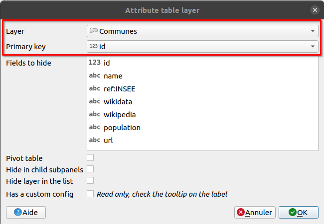
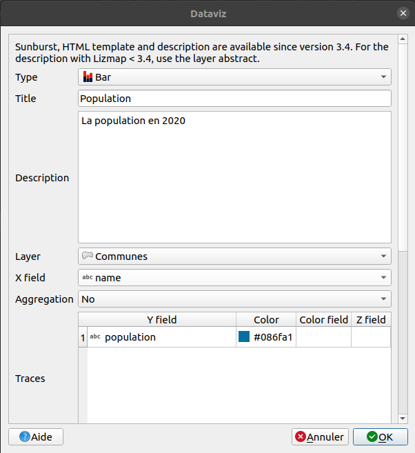
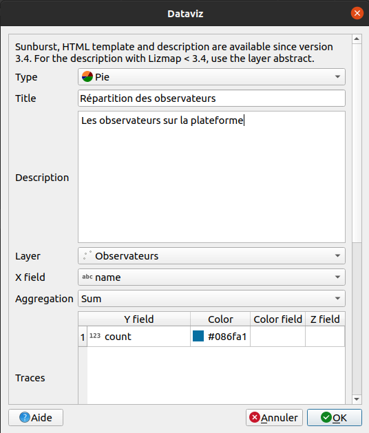
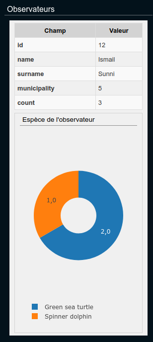
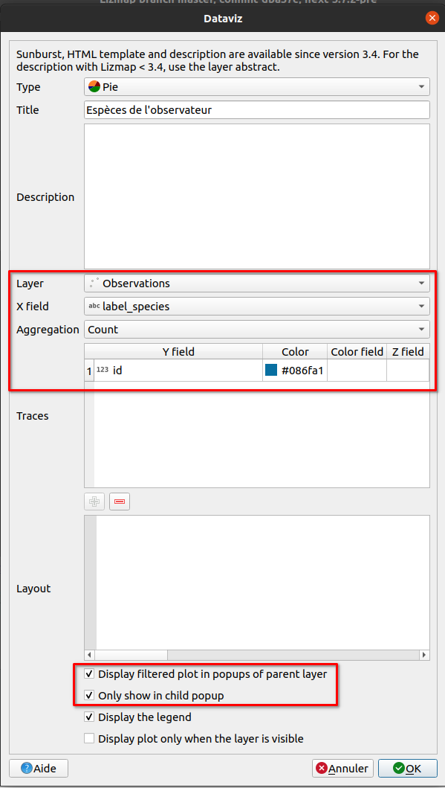
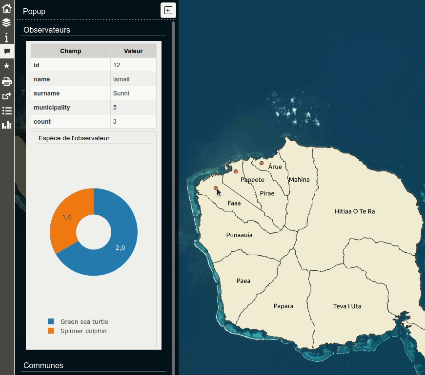

---
hide:
  - navigation
---

# Workshop Lizmap

## Pre-requirements

This workshop is designed for QGIS users.

* QGIS 3.40
* **Latest** Lizmap plugin on QGIS Desktop
* Lizmap Web Client **3.9.X**

## QGIS UC 2025

Presentations talking about QGIS Server and Lizmap during this QGIS UC from 3Liz :

* Today, one hour ago
    * Lizmap, past, present and future
    * Wait for the replay
* Room Statisten, tomorrow morning, 12:00PM
    * Dynamic layers : a single project to rule them all
    * Bonus, use the output of Dynamic Layers plugin in Lizmap

## Links

* Demo https://demo.lizmap.com
* Lizmap cloud out-of-the-box https://www.lizmap.com
* PDF/HTML presentations and videos https://docs.3liz.org/talks/#lizmap
* Discourse channel https://discourse.osgeo.org
* Twitter accounts : 
    * https://twitter.com/LizmapForQgis dedicated to Lizmap
    * https://twitter.com/3LIZ_news about 3Liz
* Source code
    * Lizmap Web Client https://github.com/3liz/lizmap-web-client/
    * Lizmap QGIS Desktop side https://github.com/3liz/lizmap-plugin/
    * Lizmap QGIS Server side https://github.com/3liz/qgis-lizmap-server-plugin
    * 3Liz https://github.com/3liz/ for QGIS Server plugins, Lizmap modules
* National user group
    * [German mailing list 🇩🇪](https://lists.osgeo.org/mailman/listinfo/lizmap-de)
    * [Japan Facebook group 🇯🇵](https://www.facebook.com/groups/lizmapusergroupjapan)
    * ... ?
* [Stafe of translations](https://docs.3liz.org/lizmap/#translations)

## Documentation

* https://docs.lizmap.com/
  * Check [the architecture and manuals](https://docs.lizmap.com/current/en/introduction.html)

## Setting up the training

* Install the **Lizmap** plugin on your QGIS
* Open it, either from the toolbar, or from the **Web** menu
* Click **Add your first server** or the **+** icon at the bottom
* Fill the wizard :
     * URL : https://workshop.lizmap.com/norrkoping
     * Login : `user_X`, replace `X` by your number in login and password
     * Password : `user@X`

!!! warning
    QGIS **might** ask you to set up a **master password**. This password belongs to **you** and is not linked to Lizmap.
    It's to lock **your internal QGIS password manager**.

!!! question
    Is-it 👍 or something else ?

!!! info
    This workshop was designed for **3 hours**, so some steps in the QGIS downloaded project are already done.

## First quick map

* Open the project
* Set the extent on the map canvas to have all islands visible
* In the Project Properties :
      * **Project** menu ➡ **Properties**
      * **Relations** tab, add all relations **automatically** with **Discover Relations** and **select them all**
        with **ctrl**
      * **QGIS Server** tab,
          * Enable **Service capabilities**
              * set a **title** such as `NAME Training` and an **abstract** about the purpose of the project.
                You can fill the **author**, **organization**, **phone**, **email** as well if you want.
              * You are free to use the text you want for these fields.
              * You can set keywords if needed. You will be to search your project with keywords in the landing page.
          * **WMS capabilities**
              * use the current canvas extent for the **advertised extent**
          * **WFS capabilities**
              * Use the checkbox **published** for **all** layers
      * Press **Ok** 
* Open the Lizmap plugin
* In the `Layers` tab, make some layers visible by default
* At the bottom, let's choose the remote "directory" where to send this project
* Press "Apply" or "OK" to start the Lizmap file generation
* Let's fix the "blocking" error
* Visit your Lizmap instance in the web browser

!!! tip
    **Bonus** if you have a small PNG picture called `name_of_project.qgs.png` to replace the default project thumbnail.
    It works as well with jpg, jpeg files.

## Quick overview of the Lizmap web interface

* The map
* Lizmap folders
* Administration panel

## Legend

* Add some groups in the legend
    * `Editing` with `persons` and `observations`
    * `Data` with `municipalities`
    * With the help of the plugin, in the fourth tab
        * You can add OSM base layer and the IGN Orthophoto.
        * `hidden` with `species`
* Reorder layers to put them inside these groups according to the screenshot below
* Rename layers with a more human-readable


!!! tip
    The `baselayers` group, you can add layers you want. This group will display layers inside as a drop-down menu.

!!! success
    Lizmap is using **QGIS Server** in the background, the legend is, therefore, the same as in QGIS Desktop.

    Some settings in the QGIS project **or** in the Lizmap plugin can have effects in the web interface.

* Make a quick symbology on a point layer :
      * on `persons`, change the default symbol using a **single symbol**.
      * On `observations`, we can try **Categorized** using the field `fk_id_specie`.
        You can use the [QML already made](./media/fk_id_species_categorized.qml)
        (Vector layer properties ➡ **Styles** at the bottom ➡ **Load styles**).
* Add labels on the municipalities layer and add a scale based visibility for these labels (1:300 000)
    * `name` field for the source
    * **Rendering** tab, scale based visibility minimum set to `1:300 000`
* Go in the Lizmap **plugin**, **Layers** tab :
    * Enable the **municipalities** layer by default  
    * Add some **links** on two layers: 
        * PDF for the persons layer : `media/metadata.pdf`, a PDF link, stored in the folder `media` on the server
          (you can see it in the WebDAV client)
        * HTML for the municipalities : `https://en.wikipedia.org/wiki/French_Polynesia`
    * Go in **Baselayers** tag and add the OpenStreetMap Mapnik background.


## Attribute table

* From the **plugin**, enable the attribute table for the **municipalities** layer.
    * In the **Attribute table** tab, add a new layer



!!! tip
    We can improve our attribute table by adding some alias on the fields :
    
    * **Properties** on the vector layer ➡ **Form attributes** ➡ **Alias** for all fields

!!! tip
    Two new tools appeared in Lizmap Web Client : **Attribute table** as expected, but also **Selection**. Let's have a
    look.

## Let's identify the feature by clicking

* In the Lizmap **plugin**, **layers** tab, enable some popups on the layer **municipalities** with `automatic` mode and
  check the results by clicking on a municipality.

!!! tip
    The **automatic** popup will use alias if available on the layer.

* Let's get back in the Lizmap **plugin** Let's switch to a popup with **QGIS HTML Maptip** mode on the same layer
* Click on the **Generate an HTML table**
* In the `communes` vector layer properties, **rendering** tab, then **HTML Maptip**, check the generated HTML.
* **Tip** : QGIS ➡ **View** ➡ **Show Map Tips** to display maptip straight in QGIS Desktop. You need to select the
  maptip tool in the toolbar as well.

These **QGIS** popups are powerful with the use of QGIS **expressions**. 🚀

### With some expressions inside

You can use expressions :

* to display with capital letters
* to display in red if the population is less than 20 000 inhabitants

Conditional formating is often used, for land surveying, date inferior to 2 months...

??? note "Display solutions"
    * The first one about capital letters, replace
    ```html
    [% "name" %]
    ```
    by
    ```html
    [% upper("name") %]
    ```
    * The second one about the population in red, replace
    ```html
        [% "population" %]
    ```
    ```html
        <font color="[% if( "population" > 20000, 'black', 'red') %]">[% "population" %]</font>
    ```

## Editing capabilities on a layer

We want now to enable editing capabilities on a layer in the Lizmap interface, to let some users add some **observations**.

* In QGIS, try to add a point and check how the **default** form is displayed on the layer **observations**.
  You need to toggle editing mode first with the **yellow** pen.
* Improve the form in QGIS :
    * Layer Properties ➡ Attributes Form -> Drag&Drop layout form
    * Remove the field `id`
    * Make two groups : `Required` and `Optional`
    


* Field configuration :
    * `fk_id_person` :
        * Alias `Watcher`
        * Relation reference with `name`
    * `fk_id_specie` :
        * Alias `Species`
        * Value relation layer `species`, key column `id` and value `es_nom_commun`
    * `date` :
        * Alias `Date`
        * Date/Time by default
    * `photo` : 
        * Alias `Photo`
        * Attachment
    * `gender` : 
        * Alias `Gender`
        * Value map and add some values in the table `Male`, `Female`
    * `fk_id_municipality` :
        * Alias `Municipality`
        * Value relation
        * Layer `municipalities`
        * Key `id`
        * Value `name`
        * Filter expression `intersects( @geometry,  @current_geometry )`


* As soon as you have your form ready in QGIS (more or less 🙂), add the layer in the **editing**
  panel in Lizmap

!!! tip
    We can use QGIS Expressions in the form (visibility, conditions, default value, etc.).
    [Read the documentation](https://docs.lizmap.com/current/en/publish/configuration/expression.html). It's ongoing work as there are different contexts for evaluating expressions.

## PDF Print

### Extent chosen by the user

* In the given QGIS project, there is already a layout `Landscape A4`.
* Enable **print** in your Lizmap plugin, **map options** tab.
* Customize the title from Lizmap web interface in the PDF :
    * Click on the title `Example workshop`
    * In the properties, look for **Object identifier** and set `title`

!!! success
    In this case, the user is choosing the area of interest

### From a popup, extent defined by the feature

* In the **QGIS layout manager**, duplicate the existing layout and let's transform it to an atlas
    * **Project** menu, **Layout  manager**, **Duplicate**, name `PDF sheet`
    * Edit this new layout
    * Enable atlas on the **municipalities** layer
    * Change the title to display the name of the municipality
    * Enable the map to "follow" the current feature
* Check in the result in Lizmap

!!! success
    While in this situation, the PDF is linked to a feature.

## Dataviz

### Bar chart

* Add **bar chart** in the Lizmap plugin about population in municipalities (and not a histogram).
    * Layer : **Municipalities**
    * X Field : **Name**
    * No aggregation
    * Trace : 
        * field **population**
        * color blue



### Pie chart

* On "persons" layer, add a pie chart about each "watcher" :
    * Add a virtual field in "persons" called `count`, integer :

```
relation_aggregate(
	relation:='observation_fk_id_person_fkey',
	aggregate:='count',
	expression:="id"
)
```

* Add **pie chart** in the Lizmap plugin
    * Title
    * Description
    * Layer : Persons
    * X Field : Name
    * Aggregation sum
    * Trace : count



### Advanced filtered plot

For now, it's only charts at the layer level. It's possible to make charts for a given feature, for instance for a given
"watcher", to know his own observations. You can watch the animated GIF at the bottom to understand the expected output,
in the **"Final result"**.



!!! tip
    Watch the [video tutorial](https://www.youtube.com/watch?v=aGJnScdkEtE) about the filtered plot.

* Add a virtual field `label_species` (text) in the `observations` layer to have the name :

```
attribute(get_feature('species_aa247cf3_58c8_4852_8ada_1d707a593cfe', 'id', "fk_id_specie"),'es_nom_commun')
```

* Add a pie chart on the `persons` layer :

    * Pie
    * Title : Species
    * Layer : Observations
    * X Field : `label_species`
    * Aggregation `Count`
    * Traces : `id`
    * Checkbox **Display filtered plot in popups of parent layer**
    * Checkbox **Only show in child popup**



??? note "Final result"
    

**Thanks 😎**
