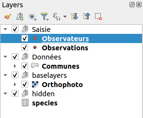
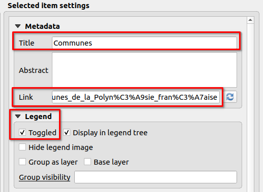

---
hide:
  - navigation
---

# Workshop Lizmap

## Pre-requirements

This workshop is designed for Lizmap users, half day.

* FTP Client (WinSCP for Windows, Filezilla for MacOS/Linux)
     * `qgis/theme_formation` : for the workshop
     * `qgis/theme_formation/media/metadata.pdf` : a PDF file
* QGIS 3.16
* Lizmap plugin on QGIS Desktop
* QGIS project attached in the email
     * The QGIS project contains layers from the PostgreSQL database
  
## Links

* Demo https://demo.lizmap.com
* Lizmap hosting out-of-the-box https://www.lizmap.com
* PDF/HTML presentations https://docs.3liz.org/talks/#lizmap
* Mailing-list Osgeo Lizmap
    * https://lists.osgeo.org/mailman/listinfo/lizmap
* Twitter accounts : 
    * https://twitter.com/LizmapForQgis dedicated to Lizmap
    * https://twitter.com/3LIZ_news about 3Liz
    * https://twitter.com/3lizRelease everytime we make a new version on GitHub in one of our project
* Source code
    * Lizmap Web Client https://github.com/3liz/lizmap-web-client/
    * Lizmap QGIS side (desktop and server) : https://github.com/3liz/lizmap-plugin/
    * 3Liz https://github.com/3liz/ for QGIS Server plugins, Lizmap modules

## Documentation

* https://docs.lizmap.com/
  * Check the Lizmap architecture and manuals

## First quick map

* Open the project
* Set the extent on the map canvas (showing all islands)
* In the Project Properties :
      * **Project** menu / **Properties**
      * **Relations** tab, add all relations **automatically** with **Discover Relations**
      * **QGIS Server** tab,
          * **Service capabilities**
              * set a **title** and an **abstract**
          * **WMS capabilities**
              * use the current canvas extent for the **published extent**
          * **WFS capabilities**
              * **publish** all layers
* Open the Lizmap plugin
* **Only one time**, add a server with your instance home page URL
    * Example `https://workshop.lizmap.com/foss4g_2021/`
    * We don't need user and password
* Close the Lizmap plugin (it's creating the Lizmap file when closing the window).
* Transfert the project (`.qgs` et `.cfg`) in the folder `qgis/topic_workshop` on the FTP

!!! tip
    **Bonus** if you have a small PNG picture called `name_of_project.qgs.png` to replace the default project thumbnail.

## Quick overview of the Lizmap web interface

* The map
* Lizmap folders
* Administration panel

## Legend

* Add some groups in the legend
    * `Editing` with `persons` and `observations`
    * `Data` with `municipalities`
    * `hidden`, with small `h`, with `species` and you can add OSM base layer (from the QGIS Browser, XYZ Tiles)
* Reorder layers to put them inside these groups according to the screenshot below
* Rename layers with a more human-readable
    * **Except** for the OSM layer, in the group `hidden`, the name must be `osm-mapnik`



!!! success
    Lizmap is using **QGIS Server** in the background, the legend is, therefore, the same as in QGIS Desktop.

    Some settings in the QGIS project **or** in the Lizmap plugin can have effects in the web interface.

!!! tip
    **Starting from now**, often send the QGS file and the CFG file on the server to check the result.

* Make a quick symbology on a point layer.
* Add labels on the municipalities layer and add a scale based visibility for these labels (1:300 000)
    * `name` field for the source
    * **Rendering** tab, scale based visibility minimum set to 1:300 000
* Go in the Lizmap **plugin**, **Layers** tab :
    * Enable the **municipalities** layer by default  
    * Add some **links** on two layers: 
        * PDF for the persons layer : `media/metadata.pdf`, a PDF link, stored in the folder `media` (you can see it in the FTP client)
        * HTML for the municipalities : `https://en.wikipedia.org/wiki/French_Polynesia`
    * Go in **Baselayers** tag and add the OpenStreetMap Mapnik background.



## Attribute table

* From the **plugin**, enable the attribute table for the **municipalities** layer.
    * In the **Attribute table** tab, add a new layer


!!! tip
    We can improve our attribute table by adding some alias on the fields :
    
    * **Properties** on the vector layer ➡ **Form attributes** ➡ **Alias** for all fields

## Let's add some popups "auto" and "qgis"

* In the Lizmap **plugin**, **layers** tab, enable some popups on the layer **municipalities** with `auto` mode and check the results by clicking on a municipality.
* Let's switch to a popup with **QGIS** mode on the same layer :


These **QGIS** popups are powerful with the use of QGIS **expressions**:

```html
<ul>
    <li>[% "name" %]</li>
    <li>[% "population" %]</li>
</ul>
```

* Copy/paste this HTML code in the `communes` vector layer properties, **rendering** tab, then **HTML Maptip**.
* **Tip** : QGIS ➡ **View** ➡ **Show Map Tips** to display maptip straight in QGIS Desktop. You need to select the maptip tool in the toolbar as well.

### Avec des expressions

You can use expressions :

* to display with capital letters
* to display in red if the population is less than 20 000 inhabitants

??? note "Display solutions"
    * The first one about capital letters :
    ```html
    <ul>
        <li>[% upper("name") %]</li>
        <li>[% "population" %]</li>
    </ul>
    ```
    * The second one about the population in red :
    ```html
    <ul>
        <li>[% upper("name") %]</li>
        <li style="color:[% if( "population" > 20000, 'black', 'red') %]">[% "population" %]</li>
    </ul>
    ```

We can have the same style as the `auto` popup with the `qgis` popup by reading the
[documentation](https://docs.lizmap.com/current/en/publish/configuration/popup.html#qgis-popup).

## Editing capabilities on a layer

We want now to enable editing capabilities on a layer in the Lizmap interface, to let some users add some **observations**.

* In QGIS, try to add a point and check how the **default** form is displayed on the layer **observations**. You need to toggle editing mode first with the **yellow** pen.
* Improve the form in QGIS :
    * Layer Properties ➡ Attributes Form -> Drag&Drop layout form
    * Remove the field `id`
    * Make two groups : `Required` and `Optional`
    


* Field configuration :
    * `fk_id_person` :
        * Alias `Watcher`
        * Relation reference with `name`
    * `fk_id_specie` :
        * Alias `Species`
        * Value relation layer `species`, key column `id` and value `es_nom_commun`
    * `date` :
        * Alias `Date`
        * Date/Time by default
    * `photo` : 
        * Alias `Photo`
        * Attachment
    * `gender` : 
        * Alias `Gender`
        * Value map and add some values in the table `Male`, `Female`


* As soon as you have your form ready in QGIS (more or less 🙂), add the layer in the **editing**
  panel in Lizmap

!!! success
    We can use QGIS Expressions in the form (visibility, conditions, default value etc).
    [Read the documentation](https://docs.lizmap.com/current/en/publish/configuration/expression.html).

## PDF Print

### Extent chosen by the user

* In the given QGIS project, there is already a layout `Landscape A4`.
* Enable **print** in your Lizmap plugin, **map options** tab.
* Customize the title from Lizmap web interface in the PDF :
    * Click on the title `Example workshop`
    * **Object identifier** ➡ `title`

!!! success
    In this case, the user is choosing the area of interest.

### From a popup, extent defined by the feature

* Duplicate the existing layout and let's transform it to an atlas
    * **Project** menu, **Layout  manager**, **Duplicate**, name `PDF sheet`
    * Edit this new layout
    * Enable atlas on the municipalities layer
    * Change the title to display the name of the municipality
    * Enable the map to "follow" the current feature
* Check in the result in Lizmap

!!! success
    While in this situation, the PDF is linked to a feature.

## Dataviz

### Bar chart

* Add **bar chart** in the Lizmap plugin about population in municipalities (and not a histogram).
    * Layer : **Municipalities**
    * X Field : **Name**
    * No aggregation
    * Trace : 
        * field **population**
        * color blue


* On "persons" layer, add a pie chart about each "watcher" :
    * Add a virtual field in "persons" called `count`, integer :

```
relation_aggregate(
	relation:='observation_fk_id_person_fkey',
	aggregate:='count',
	expression:="id"
)
```

### Pie chart

* Add **pie chart** in the Lizmap plugin
    * Title
    * Description
    * Layer : Persons
    * X Field : Name
    * Aggregation sum
    * Trace : count


### Advanced filtered plot

For now, it's only charts at the layer level. It's possible to make charts for a given feature, for instance for a given
"watcher", to know his own observations.


* Add a virtual field `label_species` (text) in the `observations` layer to have the name :

```
attribute(get_feature('species_aa247cf3_58c8_4852_8ada_1d707a593cfe', 'id', "fk_id_specie"),'es_nom_commun')
```

* Add a pie chart on the `persons` layer :

    * Pie
    * Title : Species
    * Layer : Observations
    * X Field : `label_species`
    * Aggregation `Count`
    * Traces : `id`
    * Checkbox **Display filtered plot in popups of parent layer**
    * Checkbox **Only show in child popup**


??? note "Final result"
    

**Thanks 😎**
