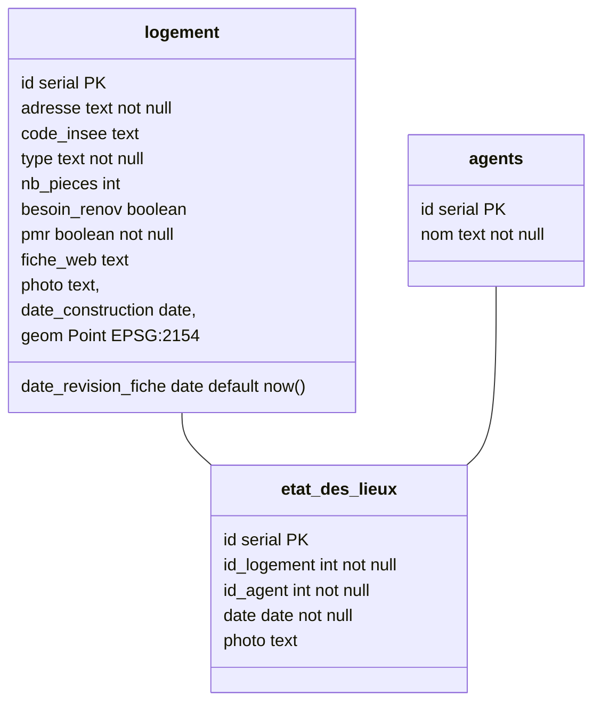
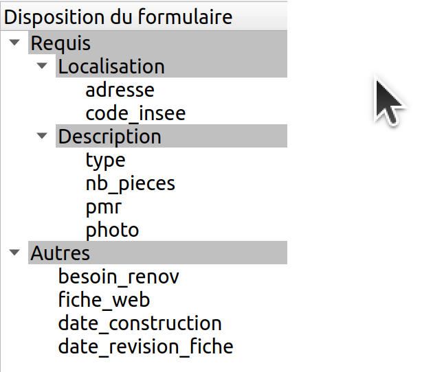

# Édition

Nous allons faire un petit modèle de données pour recenser des logements.

Nous pourrons voir à travers cet exemple différent aspect de Lizmap.



## SQL

Commençons par créer les tables.

```sql
DROP SCHEMA IF EXISTS z_formation CASCADE;
CREATE SCHEMA z_formation;
```

??? note "Afficher les solutions"
    ```sql
    CREATE TABLE z_formation.logement (
        id SERIAL PRIMARY KEY,
        adresse TEXT NOT NULL,
        code_insee text,
        type TEXT NOT NULL,
        nb_pieces INTEGER,
        besoin_renov boolean,
        pmr boolean NOT NULL,
        fiche_web TEXT,
        photo TEXT,
        date_construction DATE,
        date_revision_fiche DATE,
        geom Geometry(Point, 2154)
    );
    CREATE TABLE z_formation.agents
    (
        id SERIAL PRIMARY KEY,
        nom TEXT NOT NULL
    );

    CREATE TABLE z_formation.etat_des_lieux
    (
        id SERIAL PRIMARY KEY,
        id_logement INTEGER NOT NULL,
        id_agent INTEGER NOT NULL,
        date TIMESTAMP NOT NULL,
        photo TEXT,
        FOREIGN KEY (id_logement) REFERENCES z_formation.logement(id),
        FOREIGN KEY (id_agent) REFERENCES z_formation.agents(id)
    );
    ```

N'oublions pas l'index spatial

```sql
CREATE INDEX ON z_formation.logement USING GIST (geom);
```

!!! info

    Vous devez avoir une couche des communes avec les codes INSEE dans votre projet également.

## Propriétés du projet

* Charger les couches dans le projet QGIS.
* **Propriétés du projet**, onglet **Relations**, ajouter toutes les relations **automatiquement** avec le bouton **découvrir**.
* Vous devriez avoir 2 relations dans le tableau.

## Formulaire logement

!!! tip
    Regarder uniquement le formulaire dans QGIS bureautique dans un premier temps, pendant les différentes étapes.

* Dans les propriétés de la couche `logement` :
  * Ajouter des alias sur les champs
  * Faire un formulaire par glisser/déposer
  * Ajouter des **onglets** et des **groupes**
    

!!! tip
    Nous n'avons pas besoin du champ `id` pour nos utilisateurs lors d'une édition. C'est une information *interne*.

### Paramétrage des "outils" pour les champs

Pour l'ensemble des champs, nous allons configurer les **Type d'outil** ainsi que les contraintes si nécessaire.

Nous allons utiliser la documentation Lizmap sur
[les formulaires avancés](https://docs.lizmap.com/current/fr/publish/configuration/layer.html#edition-expressions).

* `adresse` :
    * Édition de texte
    * Ajouter une expression pour la contrainte et une erreur qui sera affichée si l'expression n'est pas valide.

!!! tip
    On remarque que QGIS détecte les contraintes des champs qui sont en base de données. Mais on peut personnaliser
    les messages d'erreurs.

!!!tip
    Concernant l'expression de **contrainte**, QGIS va l'exécuter et va vérifier si l'expression renvoi
    une valeur **booléenne** si la saisie est **valide** ou **non**.

* `code_insee` :
    * Valeur relationnelle
      * Couche **commune**
      * Clé **INSEE_COM**
      * Valeurs **NOM**
    * Expression de filtre `intersects($geometry, @current_geometry)`
    * Ajouter une contrainte et une erreur
    * Renforcer la contrainte par expression
* Liste de valeurs
    * `studio` ➡ `Studio`
    * `appartement` ➡ `Appartement`
    * `maison` ➡ `Maison`
    * ...
* `nb_pieces` :
    * Plage de valeur
* `pmr` :
    * Case à cocher
* `photo` :
    * Pièce jointe
        * Chemin par défaut, ou alors un dossier comme `../media/specific_media_folder`
        * Filtre `Images (*.png *.jpg *.jpeg)`
* `besoin_renov` :
    * Liste de valeurs
        * Valeur NULL
        * `true` ➡ `Oui`
        * `false` ➡ `Non`
* `fiche_web` :
    * Texte
       * Renforçons la contrainte avec une expression. Une regex est plus appropriée, mais utilisons une expression
         simple pour vérifier que la chaîne commence par `http`
       * Ajouter une description pour la contrainte
* `date_construction`
    * Date
        * format `dd/MM/yyyy`
        * `"date_construction" <= now()`
* `date_revision_fiche`
    * Date
        * Format date

## Utilisation des popups

Nous pouvons activer :

* les popups "Automatique" pour la couche des états des lieux.
* l'affichage des popups enfants dans la couche des logements

## Édition des tables filles

Pour permettre l'ajout des états des lieux, il faut :

* Avoir les relations
* Avoir l'édition sur les 2 couches
* Avoir l'outil de table attributaire sur les couches filles

## Quelques solutions

??? note "Vérifier qu'un champ n'est ni NULL ni une chaîne vide"
    ` "adresse" IS NOT NULL AND "adresse" <> ''`

??? note "Vérifier que la chaîne commence par `http`"
    `left("fiche_web", 4) = 'http'`
